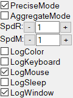

  

## How to Use:
1. **Download** the latest release or the Monacro folder.
2. **Configure** the constants in the settings file, especially the Editor Path.
3. **Run** `Main.ahk` or `Monacro.exe`.

## Navigation:
- **Left-click** a button or use the visible hotkeys to trigger an action.
- **Right-click** a button or use `Ctrl + Hotkey` to open the options menu.
- **Close the options menu** by repeating the action or losing focus.

## Actions:
- **Record**: Sends a message to unlock/lock the Logger. It will periodically flush the recording.
- **Play**: Runs the most recent script.
- **Pause**: Sends a message to lock the logger or pause the running script.
- **Edit**: Opens the most recent script in the editor.
- **Exit**: Flushes options, stops the Logger, and closes the GUI.

## Options:

### Record

  

- **Input Field**: Set a name for a new record.
- **New**: Create a new name with a suffix _(d++) based on the highest existing record.
- **Override**: Replace the file if it exists and create a backup.
- **Append**: Add the record to the end of the file. Remove `ExitApp` and `PostMessage` manually.
- **Screen Mode/Window Mode**: Mode of Coordinate Logging.

### Pause

  

- **Precise Mode**: Registers Up and Down presses with precise delay.
- **Aggregate Mode**: Registers only Down presses, combines letters, creates key loops, and sets delay.
- **SpdR**: Speed of Recording - The speed that is logged during recording.
- **SpdM**: Speed Multiplier - Script PlaySpeed is calculated by (SpdR * SpdM).
- **Various Log Option Toggles**:
  - **Log Color**: Waits for color before clicking.
  - **Log Keyboard**: Registers key presses.
  - **Log Mouse**: Registers mouse clicks and wheel actions.
  - **Log Sleep**: Logs delay between actions.
  - **Log Window**: Logs window changes.

### Play/Edit

  

- **Pick a file** to play or edit.

### Exit

  

- **Open WorkDir** in editor.
- **Create/Pick a WorkDir**. (Folder from which files are shown and recorded to)

## TODO:
- Implement second tooltip updating during script runtime.
- Update mouse delays in precise mode to reflect actual timing.
- Develop a hotkey manager to set hotkeys for scripts in the GUI, based on WorkDir.
- Add functionality to delete/rename files in Edit/Play.
- Make AggregateDelay modifiable (currently set to 200).
- How it works Readme section